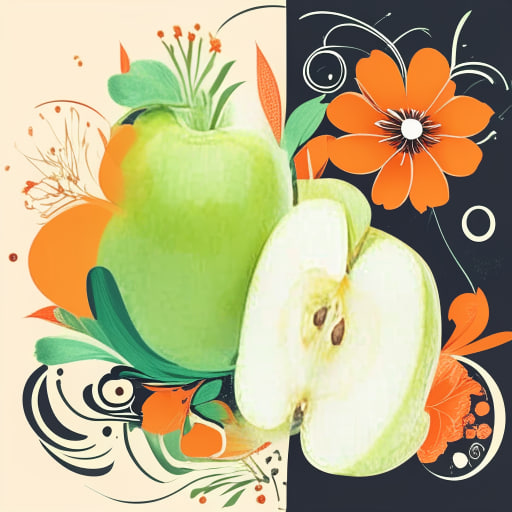
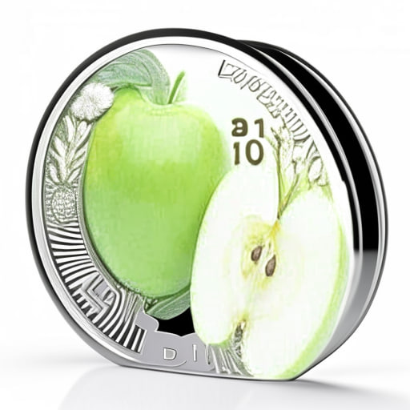
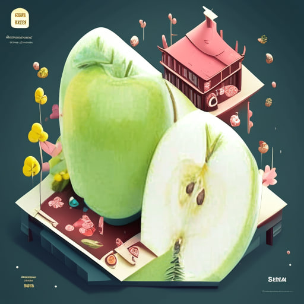

# AI Generative Product hack. Модуль генерации.
------------------------

### Генерация заднего фона для изображений товаров
Алгоритм генерации заднего фона реализован в background_generation.py и основан на удалении заднего фона с помощью [u2-net](https://github.com/danielgatis/rembg) + инпэинтинга кандинским.  
Генерит смешные неадекватные задние фоны для картинок, которые обязательно привлекут внимание покупателя. Лучше всего юзать для фото с уже удалённым задним фоном или с нейтральным фоном.  
Примеры:  





#### Установка и использование
```python
pip install rembg
pip install diffusers transformers accelerate
```
p.s. потом вынести все нужные либы в requirements.  

Алгоритм принимает путь до файла изображения и его описание. Изображение сохраняет в указанную директорию
```python
from generation.background_generation import generate_background

filename = "examples/tets/apple.png"
description = "яблоки зелёные спелые садовые" # можно генерировать отдельной моделькой
generate_background(filename, "яблоки зелёные спелые садовые", output_filename="output.jpeg")
```
